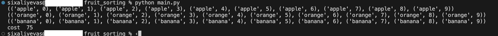

# A* algorithm for fruit sorting

This code is an implementation of the A* search algorithm to solve a fruit puzzle game. The goal of the game is to organize them so that fruits go from top to bottom in ascending order of size. The only move allowed is to swap two fruits horizontally or vertically

The heuristic function used to estimate the cost of reaching the goal state is the Manhattan distance, which measures the distance between the current state and the goal state based on the positions of the same fruit and size in each state.


The A* algorithm is implemented using a priority queue, where each element in the queue is a tuple of three values: the estimated total cost of the path to reach the goal state from the current state, the cost of the path from the initial state to the current state, and the current state itself. The algorithm starts with the initial state and iteratively explores the neighboring states with the lowest estimated cost until the goal state is reached.


## Deployment

Initial state of fruits is defined statically inside the code, such as:
```
initial_state = [
    [('apple', 5), ('apple', 4), ('apple', 6), ('apple', 1), ('apple', 9),
     ('apple', 3), ('apple', 0), ('apple', 2), ('apple', 8), ('apple', 7)],
    [('banana', 8), ('banana', 1), ('banana', 9), ('banana', 4), ('banana', 3),
     ('banana', 7), ('banana', 2), ('banana', 5), ('banana', 6), ('banana', 0)],
    [('orange', 0), ('orange', 4), ('orange', 2), ('orange', 3), ('orange', 9),
     ('orange', 6), ('orange', 1), ('orange', 8), ('orange', 7), ('orange', 5)]
]
```

To deploy this project run

```bash
  python main.py
```


## Screenshots



